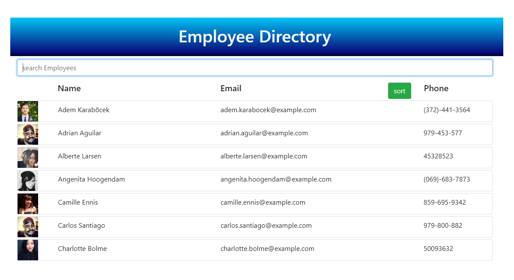

# 
React Employee Directory

 A responsive user directory utilizing React library. The page should sort by email address and filter by name.
 
*****
## 
Table of Contents

* [Installation](https://github.com/craigfbarry/react-employee-directory#installation)

* [Usage](https://github.com/craigfbarry/react-employee-directory#usage)

* [LIcense](https://github.com/craigfbarry/react-employee-directoryr#license)

* [Contributing](https://github.com/craigfbarry/react-employee-directory#contributing)

* [Tests](https://github.com/craigfbarry/react-employee-directory#testing-framework)

* [Technologies Used](https://github.com/craigfbarry/react-employee-directory#technologies-used)

* [Author](https://github.com/craigfbarry/react-employee-directory#author)

* [Github URL](https://github.com/craigfbarry/react-employee-directory#github)

* [Acknowledgements](https://github.com/craigfbarry/react-employee-directoryr#acknowledgements)

*****

#### Installation

        Deployed to Heroku

#### Usage

Uses random API randomuser.me to build user data.

#### License

#### Contributing

None

#### Testing framework

        None

#### Technologies used

        React Axios Bootstrap

#### Author

[@craigfbarry](https://github.com/craigfbarry/)

#### Github URL

https://github.com/craigfbarry/react-employee-directory

#### Acknowledgements

None

    